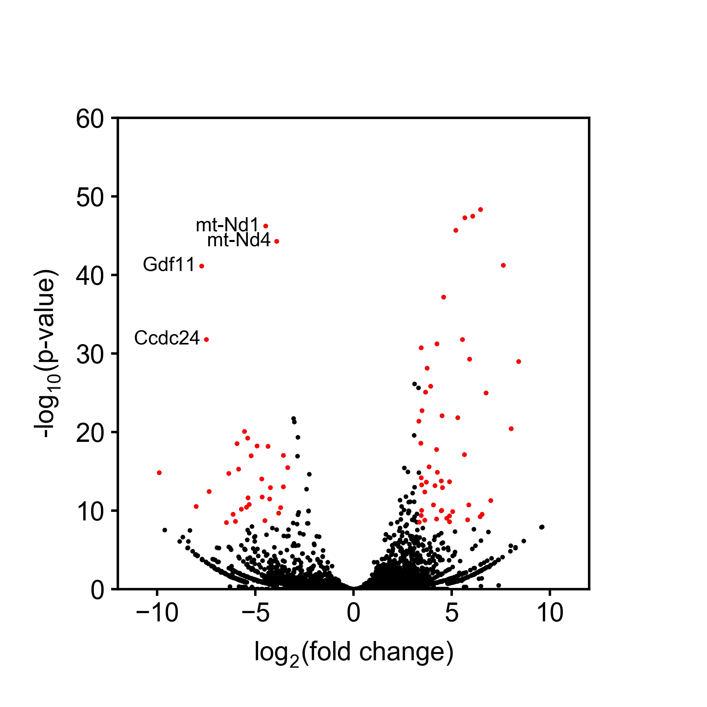

# Create a volcano plot
The purpose of this program was to create a volcano plot from expression data. Further, points are colored red if their fold-change is larger than 10 (up or down) and their -log10(p-value) is above 8.

Points are labeled with their gene name if their fold-change is larger than 10 (only down) and their -log10(p-value) is greater than 30.

This was the image to be copied:

This is the result of my code:

This image can be generated by running `McCreath_Benjamin_BME263_Assignment_Week3.py` with `BME163_Input_Data_2.txt` in the same directory.
